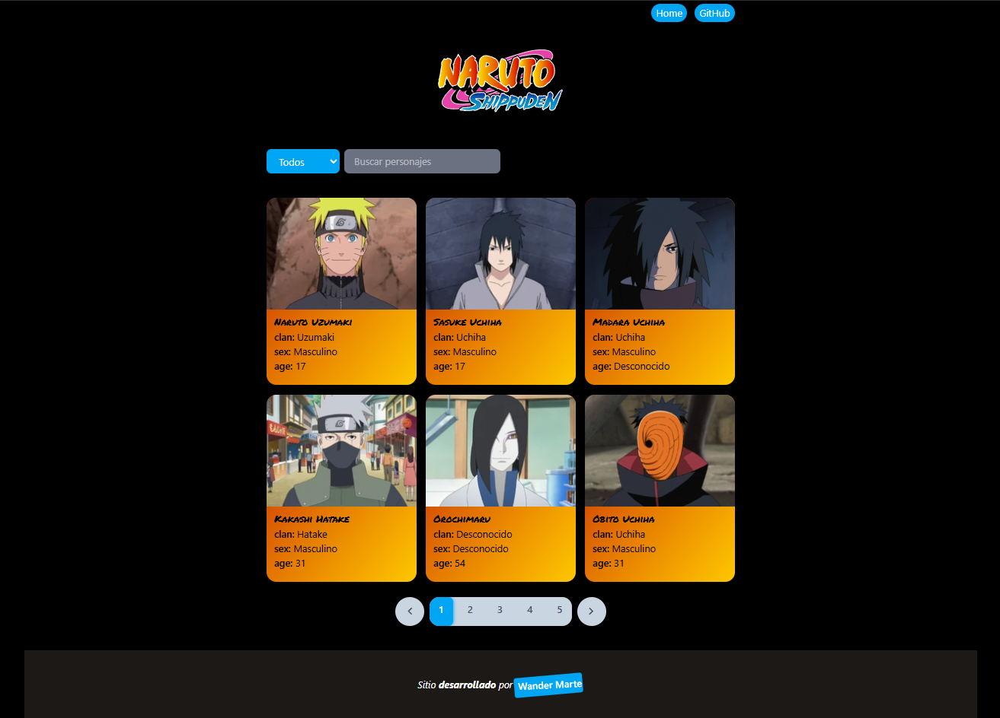

# 🌟 Página de Personajes de Naruto Shippuden

Este proyecto es una página web interactiva que muestra una lista completa de los personajes de **Naruto Shippuden**, junto con toda su información relevante. Incluye funcionalidades de **paginación** y **filtrado de búsqueda** para facilitar la navegación y encontrar personajes específicos de manera rápida y sencilla. Diseñado para los fans del anime, con un enfoque en la usabilidad y un diseño moderno.

## 🚀 Características

- 📜 **Lista completa de personajes**: Explora todos los personajes de Naruto Shippuden.
- 🔍 **Filtrado de búsqueda**: Encuentra personajes fácilmente utilizando el buscador.
- 📄 **Paginación dinámica**: Navega cómodamente entre las páginas de personajes.
- 🎨 **Diseño moderno**: Interfaz atractiva y fácil de usar.
- ⚡ **Desarrollado con Astro**: Aprovecha la velocidad y simplicidad de Astro para un rendimiento óptimo.

## 🌐 Tecnologías Utilizadas

* Astro: Framework para construir sitios web rápidos y modernos.
* JavaScript/TypeScript: Para la lógica interactiva.
* HTML/CSS: Para la estructura y el diseño.
* Bun: Administrador de paquetes y servidor de desarrollo.

## 📷 Capturas de Pantalla




## 📂 Estructura del Proyecto

Dentro del proyecto, encontrarás la siguiente estructura de carpetas y archivos:

```text
/
├── public/
│   ├── assets/                # Imágenes y recursos estáticos
│   └── favicon.svg
├── src/
│   ├── components/            # Componentes reutilizables (e.g., Paginación, Filtros)
│   ├── layouts/               # Diseños base para las páginas
│   ├── pages/                 # Páginas principales del sitio
│   │   ├── index.astro        # Página principal
│   │   └── personajes.astro   # Página de personajes
│   └── styles/                # Archivos de estilos
└── [package.json](http://_vscodecontentref_/0)               # Configuración del proyecto

## 🚀 Iniciar el proyecto 💻 En local
#Sigue estos pasos para ejecutar el proyecto en tu entorno local:


1. Clona el repositorio:

```bash
git clone [https://github.com/MWandev/naruto-shippuden-gallery.git](https://github.com/MWandev/naruto-shippuden-gallery.git)
cd naruto-shippuden-gallery
```

2. Instala las dependencias:

```bash
bun install
// o
pnpm install
```

3. Inicia el entorno de desarrollo:

```bash
bun dev
// o
pnpm dev
```